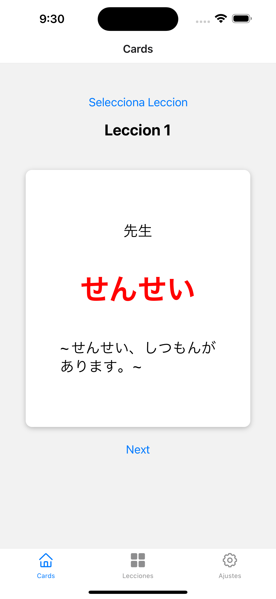
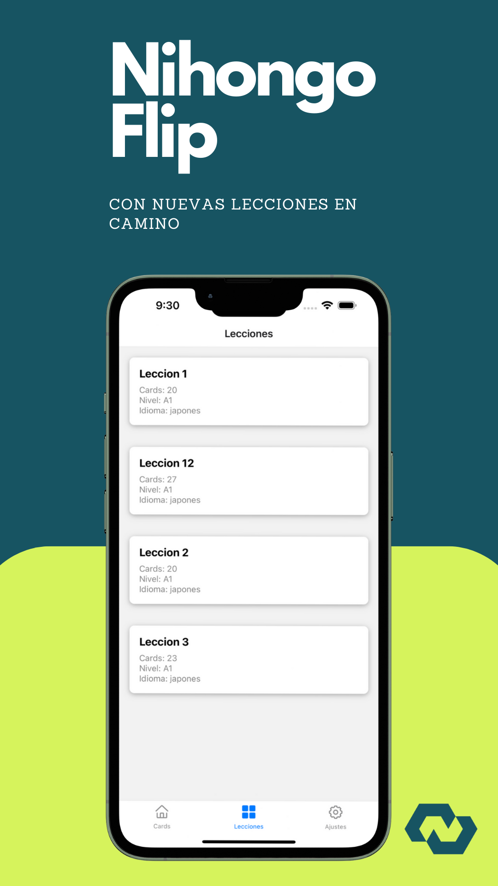

# LanguageCards 📚

Una aplicación de React Native para el aprendizaje de idiomas con tarjetas estilo Anki, que permite a los usuarios aprender y practicar vocabulario y frases en diferentes idiomas mediante tarjetas interactivas.

## 📸 Capturas de Pantalla

## 🚀 Descripción

LanguageCards está diseñada para ofrecer una experiencia de aprendizaje interactiva y atractiva, permitiendo a los usuarios practicar idiomas con el método de repetición espaciada. La integración con Firebase Firestore ofrece un backend robusto y escalable, facilitando la gestión de tarjetas y lecciones.

## 🌟 Características Principales

- **Práctica con Tarjetas**: Practica idiomas con tarjetas que muestran frases y vocabulario.
- **Lecciones Personalizadas**: Acceso a diferentes sets de tarjetas organizados por lecciones.
- **Progreso del Usuario**: Visualización del progreso en cada lección.
- **Integración con Firebase Firestore**: Uso de Firestore para almacenar y recuperar datos de tarjetas y lecciones.

## 💻 Tecnologías Utilizadas

- React Native
- Firebase Firestore
- Expo

## 📚 Retos y Soluciones

Algunos de los retos enfrentados durante el desarrollo incluyen:

- **Integración de Firebase en React Native**: Configurar Firebase para que funcione con React Native, asegurando la compatibilidad entre plataformas.
- **Diseño de UI/UX para Múltiples Plataformas**: Crear una experiencia de usuario consistente y atractiva en Android e iOS.
- **Manejo de Estados en React Native**: Utilizar estados y efectos correctamente para gestionar la lógica de la aplicación sin comprometer el rendimiento.

### 🔍 Páginas Web Consultadas

- [React Native Documentation](https://reactnative.dev/docs/getting-started)
- [Firebase for React Native](https://firebase.google.com/docs/react-native/setup)
- [Expo Documentation](https://docs.expo.dev/)

## ⚙️ Configuración del Proyecto

Para configurar y ejecutar este proyecto en tu entorno de desarrollo:

1. Clona el repositorio.
2. Ejecuta `npm install` o `yarn install` para instalar las dependencias.
3. Configura tu proyecto Firebase y obtén tu `google-services.json` o `GoogleService-Info.plist`.
4. Inicia la aplicación con `expo start`.

## 📖 Cómo Subir Contenido a la Base de Datos

(Esta sección debe ser completada con detalles específicos sobre cómo los usuarios pueden subir tarjetas y lecciones a la base de datos de Firestore.)

## 🤝 Contribuir

Si deseas contribuir a este proyecto, te invitamos a realizar un pull request o enviar un correo a [business@noeosorio.com](mailto:business@noeosorio.com).

## 📝 Licencia

Este proyecto está licenciado bajo la Licencia MIT. Consulta el archivo [LICENSE](LICENSE) para más detalles.